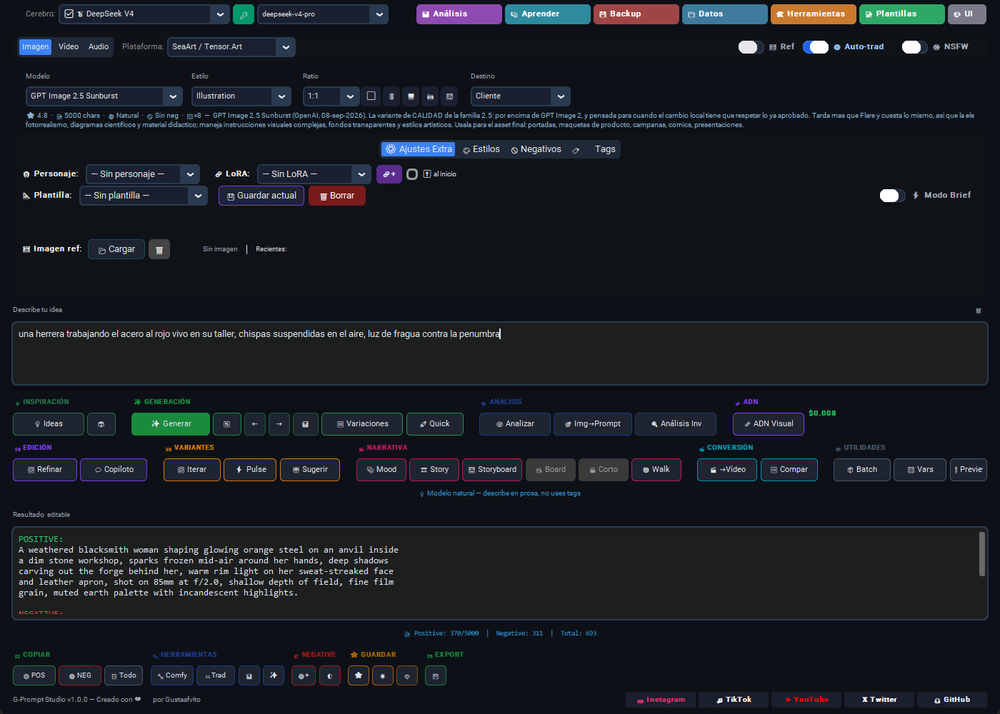
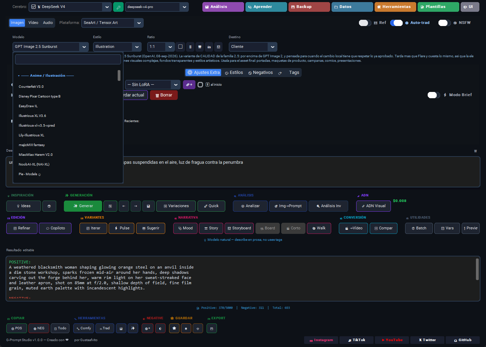
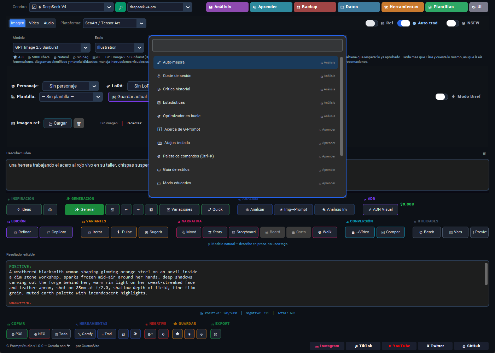

# 🧠 G-Prompt Studio v1.0.0

> A desktop prompt-engineering suite for generative AI.
> Turns a plain idea into precise instructions for **image, video and audio**.

[](https://gustaafvito.com/)
[](https://github.com/Gustaafvito/gprompt-studio/actions/workflows/ci.yml)
[](https://www.python.org)
[](LICENSE)
[](https://github.com/Gustaafvito/gprompt-studio)

[Español](README.md) · **English**

<p align="center">
  <a href="https://github.com/Gustaafvito/gprompt-studio/releases/download/v1.0.0/GPromptStudio-Setup-1.0.0.exe">
    
  </a>
</p>

<p align="center">
  <sub>118 MB &middot; 64-bit Windows 10 or 11 &middot; no Python, no administrator rights<br>
  Rather not install anything? <a href="https://github.com/Gustaafvito/gprompt-studio/releases/latest">Portable build and SHA-256 hashes</a></sub>
</p>


---



<p align="center"><em>One sentence in → the prompt that this particular model understands, with its negative and its settings.</em></p>

---

## Why this exists

I started generating images and video and kept hitting the same wall: every
model wants its prompt a different way. Flux wants prose, SDXL wants tags,
some accept a negative prompt and others ignore it, each has its own
character limit and its own sampler. My notes were scattered across
documents, open tabs and screenshots — and I still kept writing the prompt
for the wrong model.

I couldn't find one place where all of it lived together, so I built it.
G-Prompt Studio is those notes turned into a tool: write the idea in plain
language, pick the model, and out comes a prompt that follows **that
model's** rules.

---


## It works

The prompts behind my **two most recent SeaArt awards** were written by this
tool — both on Wan 3.0, September 2026:

- [«¡Esa cosa flotante en el cielo me da escalofríos!»](https://www.seaart.ai/postDetail/daff1kle878c73923gj0)
- [«¡Un castillo de chatarra de niño es asombroso!»](https://www.seaart.ai/postDetail/daen215e878c73fpeong)

Open either one and you'll see the full prompt: three choreographed shots,
camera direction, colour palette and audio design. That's what the tool
writes once you tell it the target is Wan 3.0.

---

## ✨ What it does

You type something simple — *"a girl with silver hair in a magical forest"* —
and it becomes a professional prompt tuned to the exact model you are about
to use: its rules, its tags, its limits, its recommended sampler and, where
it applies, its negative prompt.

**271 models across 13 platforms**, each with its own rules:

| Mode | Models | Platforms |
|------|--------|-----------|
| 🖼 **Image** | **164** | SeaArt/Tensor.Art (127) · Magnific (31) · GPT Image (4) · Higgsfield (4) · Grok (3) |
| 🎬 **Video** | **99** | SeaArt Video (91) · Pollo AI (7) · Kling AI (5) · Grok (2) · Veo/Gemini (2) · Higgsfield (1) |
| 🎵 **Audio** | **8** | Suno (5) · SeaArt Audio (4) · Udio (2) — lyrics, style, mood, voice and language |

**And your own on top of those**: ComfyUI checkpoints aren't counted here
because they differ on every machine.

Among them: FLUX.1, Z-Image, Qwen Image 3.0 / 3.0 Pro, Illustrious, Pony,
Nano Banana, Wan 3.0 and Wan 3.0 Prime, Kling, Seedance, Hailuo, PixVerse,
Vidu, Sora 2, Veo, Suno v5.5… plus **333 styles** grouped by family.

Your local **ComfyUI models are detected automatically**: point it at your
folder and the tool sorts every checkpoint into its family so it can apply
the right prompt format.

## 🧠 Multi-brain (13 providers)

Connect any of these with a single key. The eleven cloud providers were
verified one by one with real keys — live catalogue plus an actual call to
every model in the dropdown. If a model disappears from its provider's
catalogue, the app hides it on its own.

| Provider | Type | Cost |
|----------|------|------|
| 🥈 **DeepSeek V4** | Paid | ~€0.14/1M tokens |
| 💎 **Claude (Anthropic)** | Paid | ~€2.40/1M tokens |
| 💎 **Fireworks AI** | Paid | Fast open-source models |
| 🏆 **Google Gemini** | Free | 15 rpm |
| 🏆 **Groq** | Free | 14,400 req/day |
| 🏆 **LM Studio** | Local | OpenAI-compatible server |
| 💎 **Mistral** | Paid | European models |
| 🏆 **Ollama** | Local | No internet, no cost |
| 💎 **OpenAI** | Paid | GPT-6 Astra, the 5.x and 4.x families |
| 🥈 **OpenRouter** | Paid | 100+ models with ONE key |
| 💎 **Perplexity** | Paid | Models with live web search |
| 💎 **Together AI** | Paid | Open-source and proprietary models |
| 💎 **xAI (Grok)** | Paid | Grok 4.6, 4.5, 4.3 — up to 1M context |

**Gemini and Groq are free and need no card**, so you can run the whole app
without paying anything.

## 🚀 Main features

| Feature | What it does |
|---|---|
| 💡 **Ideas** | 3 creative ideas based on your styles |
| ✨ **Generate** | Turns your idea into a prompt shaped for the model |
| 🔀 **Variations ×3** | 3 different angles on the same concept |
| 👁 **Analyse image** | Describes a reference image (Gemini → Ollama → OpenRouter) |
| 🎯 **Img→Prompt** | Builds a prompt anchored to an image |
| 🔁 **Refine** | Improves and expands the current prompt |
| 💬 **Copilot** | A chat to dictate specific changes |
| 📦 **Batch** | Bulk generation, 2–10 prompts at a time |
| 🎨 **Preview** | Quick sketch through Pollinations |
| ⚡ **Brief mode** | Tuned for ads and contests |
| 👋 **Welcome** | On a first run with no keys, walks you to a free or local brain |

## 📋 Your data

- **🌟 Starred** — prompts that worked, with a score and the model used
- **⭐ Favourites** — the ones you bookmarked
- **📋 History** — the last 100 prompts
- **🧑 Characters** — reusable descriptions
- **🔗 LoRAs** — saved trigger words
- **📐 Templates** — full setups (mode + model + styles + ratio)
- **💾 Weekly automatic backup** — a zip every 7 days in `~/.arquitecto_prompts/backups/`
- **📤 Export** to `.txt`, `.csv` or Midjourney/Grok CLI format

## 🎯 How it adapts

- **Per model**: every model carries specs (sampler, CFG, steps, max_chars,
  negative) that get injected into the LLM. Pick Kling 3.0 and the LLM
  *knows* Kling 3.0's rules.
- **Per format**: it detects whether the model wants SD tags or natural
  language and enforces the right one.
- **Per destination**: Instagram, TikTok, YouTube, Freepik and others each
  reshape the prompt — ratio, style, hook.
- **ComfyUI + Turbo**: detected automatically, and numeric weights like
  `(tag:1.2)` are stripped because they break Turbo models.
- **Smart negatives**: a NEGATIVE PROMPT is added only when the model
  supports one.

## 🛠 Install

### The normal way: download and install

Go to [**Releases**](https://github.com/Gustaafvito/gprompt-studio/releases),
grab `GPromptStudio-Setup-1.0.0.exe` and open it. **No Python, no
dependencies** — everything ships inside.

- Windows 10 or 11, 64-bit
- No administrator rights needed — it installs into your user profile
- Windows will show a SmartScreen warning because the executable isn't
  code-signed: *More info* → *Run anyway*. The release page carries the
  SHA-256 hash and the VirusTotal analysis so you can check it yourself

There is also a **single-file portable build** if you'd rather not install.

### From source (development)

Only if you want to work on the code or run it on macOS/Linux. Requires
**Python 3.10 or newer**:

```bash
git clone https://github.com/Gustaafvito/gprompt-studio.git
cd gprompt-studio
pip install -e .
python main.py
```

For every optional dependency (Claude, keyring, vision…):

```bash
pip install -e ".[all]"
```

On first run a **setup wizard** asks for your API keys, with a
**🧪 Test connection** button that checks the key actually works.

### API keys

Keys are stored securely, in this order of preference:

1. **Windows Credential Manager / macOS Keychain / Secret Service** (through
   `keyring`, if installed)
2. `~/.arquitecto_prompts/keys.json` (fallback, encrypted with Windows DPAPI)
3. Environment variables from `.env`

```bash
pip install keyring
```

### Ollama (local, no internet)

```bash
# install from ollama.com
ollama run llama3.1
ollama pull llava       # for vision
```

## 🧪 Tests

```bash
pip install -e ".[dev]"
pytest tests/ -v   # → 1319 passed
```

## ⌨ Keyboard shortcuts

29 registered — `Ctrl+?` shows the full list.

| Shortcut | Action |
|----------|--------|
| `Ctrl+Enter` | Generate prompt |
| `Ctrl+Shift+Enter` | Variations ×3 |
| `Alt+Enter` | Quick generate |
| `Ctrl+K` | Command palette |
| `Ctrl+I` | Creative ideas |
| `Ctrl+S` / `Ctrl+Shift+S` | Save favourite / star |
| `Ctrl+F` | Global search |
| `Ctrl+Shift+R` | Refine prompt |
| `Ctrl+Shift+D` | Dashboard |
| `Alt+1/2/3` | Image / video / audio mode |
| `F11` | Full screen |
| `Escape` | Close the active popup |

## 🔒 Security and privacy

- Your keys live in the OS keyring when available, never in the repository.
- **The app sends nothing to any server of mine.** It only talks to the
  providers you configure.
- Atomic writes (tmp + rename) on every JSON file, so a crash can't corrupt
  your data.
- A corrupt `preferencias.json` is recovered automatically at startup, with
  a `.bak` kept.
- Dependencies are audited for known CVEs (`pip-audit`) on every build.

---

## Screenshots

<table>
<tr>
<td width="50%">



**271 models with their own spec sheet**, grouped by family and searchable.
If you use ComfyUI, yours show up on their own.

</td>
<td width="50%">



**`Ctrl+K`** and type what you want. Every tool one keystroke away, no
digging through menus.

</td>
</tr>
</table>

---

## Questions, bugs and ideas

- **Something broken?** Open an
  [issue](https://github.com/Gustaafvito/gprompt-studio/issues). Tell me what
  you were doing, what you expected and what happened, and attach the log —
  `%USERPROFILE%\.arquitecto_prompts\logs\gprompt.log`. With the log it gets
  fixed in half the time.
- **A question or an idea?**
  [Discussions](https://github.com/Gustaafvito/gprompt-studio/discussions).
  Answered in public on purpose, so the next person with the same question
  finds it without asking.
- **A security issue?** Please don't open a public issue. Reach me privately
  through [gustaafvito.com](https://gustaafvito.com/) and give me a chance to
  fix it first.

The interface is bilingual Spanish/English and follows your Windows
language; you can switch it under **UI → 🌐 Language**.

---

**Built by [Gustaafvito](https://gustaafvito.com/)** ·
[Web](https://gustaafvito.com/) ·
[GitHub](https://github.com/Gustaafvito) ·
[Instagram](https://www.instagram.com/gustaafvito.creador.ia) ·
[TikTok](https://www.tiktok.com/@gustaafvito.creador.ia) ·
[YouTube](https://www.youtube.com/@GustaafvitocreadorIA)

## Licence

Apache License 2.0 — see [LICENSE](LICENSE) and [NOTICE](NOTICE).

**Copyright 2026 Gustavo Luis Sánchez Escobar** («Gustaafvito»).

You may use, modify and redistribute this software, including commercially.
In exchange the licence asks three things: keep the copyright notice and the
NOTICE file, state the changes you make, and don't use the project's name to
suggest a modified version is the original.
